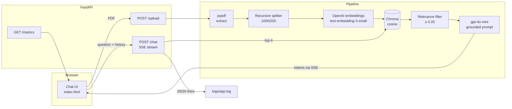

# 📄 RAG Chatbot — Chat with your PDFs

**🔗 Live demo:** [https://rag-chatbot.onrender.com](#) *(placeholder — replace after deploying to Render)*

A production-style Retrieval-Augmented Generation chatbot that answers questions **only** from the PDFs you upload — with streaming answers, cited sources, structured observability, and a measured evaluation suite.

## ✨ Features

- **PDF ingestion** — text extraction (pypdf), recursive chunking (1,000 chars / 200 overlap), OpenAI `text-embedding-3-small` embeddings, persistent Chroma vector store with filename + page metadata
- **Grounded answers** — `gpt-4o-mini` answers strictly from retrieved context and says *"I don't have that information in the uploaded documents"* rather than hallucinating
- **Live streaming** — answers type out token-by-token over Server-Sent Events
- **Cited sources** — every answer shows filename, page, and cosine similarity score in a collapsible panel
- **Conversation memory** — the last 6 exchanges travel with each request, so follow-ups like *"and who leads it?"* resolve correctly
- **Smart relevance filtering** — chunks below a cosine-relevance threshold are dropped from the prompt (−22% input tokens); clearly off-topic questions refuse in ~176 ms without an LLM call, while vague questions fall back to the top candidates
- **Observability** — every chat is logged as a JSON line (retrieval/LLM/total latency, token usage) and `GET /metrics` exposes running totals
- **Evaluation suite** — automated 10-question benchmark measuring retrieval hit rate, LLM-judged faithfulness, latency, and cost

## 🏗 Architecture



## 🧰 Tech stack

| Layer | Technology |
|---|---|
| Backend | Python 3.12, FastAPI, Uvicorn |
| RAG | LangChain, Chroma (cosine), OpenAI `text-embedding-3-small` + `gpt-4o-mini` |
| PDF parsing | pypdf |
| Frontend | Vanilla HTML/CSS/JS, Server-Sent Events |
| Observability | JSON-lines logging, `/metrics` endpoint |
| Deployment | Docker, Render (free tier) |

## 🚀 Local setup

```bash
git clone https://github.com/SaiAnjesh/test_project_ai_01.git
cd test_project_ai_01

python -m venv .venv
.venv\Scripts\pip install -r requirements.txt        # Windows
# .venv/bin/pip install -r requirements.txt          # macOS/Linux

# create .env with your key (never committed):
# OPENAI_API_KEY=sk-...

.venv\Scripts\python -m uvicorn main:app --host 127.0.0.1 --port 8000
```

Open <http://127.0.0.1:8000>, upload a PDF, and ask away.

### Docker / Render

```bash
docker build -t rag-chatbot .
docker run -p 8000:8000 -e OPENAI_API_KEY=sk-... rag-chatbot
```

Deploying to Render: push the repo, create a **Blueprint** from `render.yaml`, and set `OPENAI_API_KEY` in the dashboard. The free tier has an **ephemeral filesystem** — uploaded documents reset when the service restarts (the UI notes this).

## 📊 Evaluation

`eval.py` generates 10 factual Q/A pairs from a 6-page test document (each with a **verbatim evidence quote**, validated against the source text), runs them through the real pipeline, and measures:

- **Retrieval hit rate@4** — is the evidence quote inside a retrieved top-4 chunk?
- **Faithfulness (1–5)** — `gpt-4o-mini` judges the answer against the retrieved context with a fixed rubric at temperature 0
- **Latency & token cost** — per stage and end-to-end

Latest results (`eval_results.json`):

| Metric | Baseline (L2, no filter) | Current (cosine + relevance filter) |
|---|---|---|
| Hit rate @ top-4 | 100% | **100%** |
| Avg faithfulness | 5.0 / 5 | **5.0 / 5** |
| Avg latency | 971 ms | **859 ms** (−12%) |
| Avg input tokens | 559 | **479** (−14%) |
| Similarity scores | invalid (−0.36…0.44) | **valid 0–1 cosine** |

Reproduce with:

```bash
.venv\Scripts\python eval.py            # add --reingest / --regenerate to rebuild
```

## 🔭 Next improvements

- **Hybrid search + reranking** — combine BM25 keyword search with dense vectors, then rerank with a cross-encoder for higher precision on multi-document stores
- **Azure AI Search** — swap Chroma for a managed index with built-in hybrid + semantic ranking for production scale
- **Persistent storage** — move the vector store and uploads to a managed database / object storage so documents survive restarts
